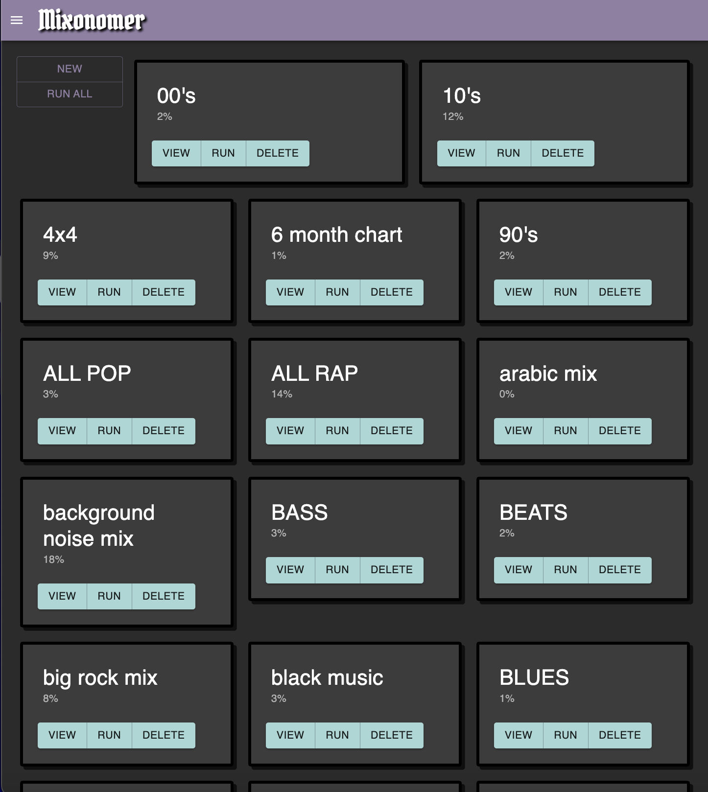
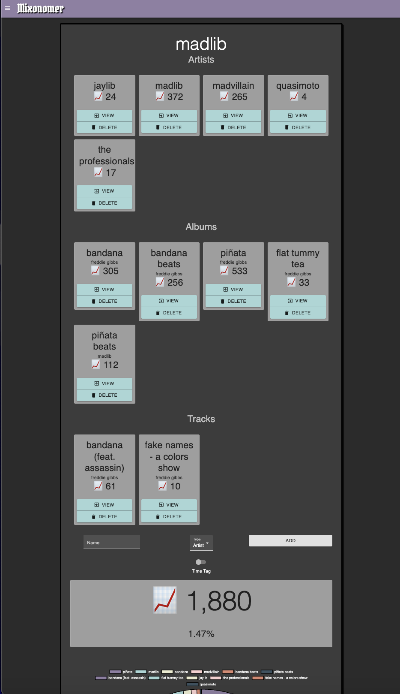

[Music Tools](https://music.sarsoo.xyz)
==================

Set of utility tools for Spotify and Last.fm. 
Built on my other libraries for Spotify ([spotframework](https://github.com/Sarsoo/spotframework)), Last.fm ([fmframework](https://github.com/Sarsoo/pyfmframework)) and interfacing utility tools for the two ([spotfm](https://github.com/Sarsoo/pyfmframework)). Currently running on a suite of Google Cloud Platform services. An iOS client is currently under development [here](https://github.com/Sarsoo/Music-Tools-iOS).

Read the full documentation [here](https://sarsoo.github.io/Music-Tools/).

# Smart Playlists

Create smart playlists for Spotify including tracks from playlists, library and Spotify recommendations.

Playlists can pull tracks from multiple sources with some extra ones based on the playlist's type.

* Spotify playlists 
    - Currently referenced by case-sensitive names of those followed by the user
    - Plan to include reference by Spotify URI
* Other Music Tools playlists
    - Dynamically include the Spotify playlists of other managed playlists
    - Used to allow hierarchy playlists such as for genre (as seen above for multiple rap playlists)
* Spotify Library Tracks
* Monthly Playlists
    - ONLY for "Recents" type playlists
    - Find user playlists by name in the format "month year" e.g. february 20 (lowercase)
    - Can dynamically include this month's and/or last month's playlist at runtime 
* Last.fm track chart data
    - ONLY for "Last.fm Chart" type playlists
    - Include variable number of top tracks in the last date range

When not shuffled, playlists are date sorted with newest at the top for a rolling album artwork of newest releases.

Playlists are updated using the [spotframework](https://github.com/Sarsoo/spotframework) playlist engine three times a day.

# Tags

Groups of Last.fm objects for summing of scrobble counts and listening statistics.

## Structure

This repo consists of a front-end written in React.js and Material-UI being served by a back-end written in Flask.

The application is hosted on Google Cloud Infrastructure.

As this codebase stands it's not really re-useable as is, references to the cloud infrastructure are hard-coded.

## Acknowledgements

Took inspiration from Paul Lamere's [smarter playlists](http://smarterplaylists.playlistmachinery.com/).